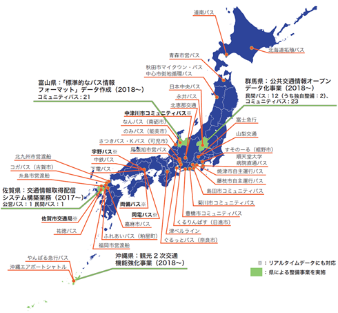
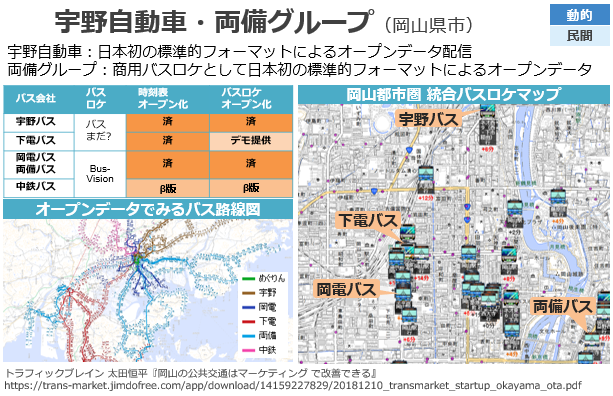
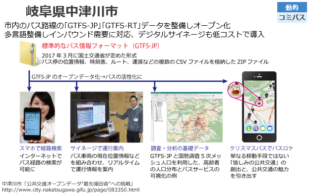
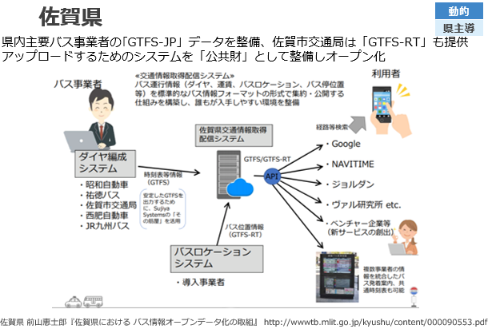
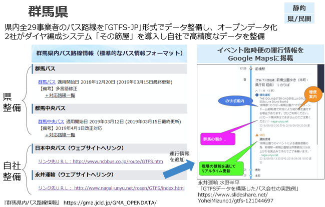

国土交通省　平成31年3月27日版

# データ整備・活用事例

## 全国のデータ整備状況

国内で整備されているGTFSデータ・「標準的なバス情報フォーマット」データについては、下記サイト等にて一覧することができます。

* 旭川高等専門学校 嶋田鉄兵「GTFS・『標準的なバス情報フォーマット』オープンデータ一覧」
  * http://tshimada291.sakura.ne.jp/transport/gtfs-list.html

2019年2月時点で**全国90社**が、標準的なバス情報フォーマット・GTFS形式のデータをオープンデータとして公開しています。（下図：東京大学 伊藤昌毅 作成、情報源：嶋田鉄兵）

## 「標準的なバス情報フォーマット」データ整備事例

データ整備事例としては下記の事例があります。

### 動的データ（GTFS Realtime）整備事例

| バス事業者                   | 静的データ出力システム   | 動的データ出力システム     | オープン化                                                   |
| ---------------------------- | ------------------------ | -------------------------- | ------------------------------------------------------------ |
| 宇野自動車                   | その筋屋(Sujiya Systems) | バスまだ？(Sujiya Systems) | [配信サイト](http://www3.unobus.co.jp/opendata/)             |
| 両備バス・岡電バス           | Bus-Vision(リオス)       | Bus-Vision(リオス)         | [配信サイト](https://loc.bus-vision.jp/ryobi/view/opendata.html) |
| 中津川市                     | その筋屋(Sujiya Systems) | Sky Brain(ヴァル研究所)    | [配信サイト](http://www.city.nakatsugawa.gifu.jp/page/083409.html) |
| 佐賀市交通局（佐賀県 事業）  | その筋屋(Sujiya Systems) | ユニトランド 製            | [配信サイト](http://opendata.sagabus.info/)                  |
| みちのりホールディングス各社 | PTD-HS(ジョルダン)       | PTD-HS(ジョルダン)         |                                                              |

### 静的データ（GTFS-JP）整備事例

整備主体等の特徴別の事例を下記に示します。

| バス事業者   | 静的データ出力システム | オープン化                                                   | 整備主体等の特徴                                           |
| ------------ | ---------------------- | ------------------------------------------------------------ | ---------------------------------------------------------- |
| 永井運輸     | その筋屋               | [配信サイト](http://www.nagai-unyu.net/rosen/GTFS/index.html) | 中小事業者による自社整備                                   |
| 青森市交通部 | その筋屋               | [配信サイト](https://www.city.aomori.aomori.jp/kotsu-kanri/koutsu/oshirase/20180401gtfso-punnde-ta.html) | 公営バスによる自社整備                                     |
| 富山県内各社 | その筋屋, 西沢ツール   | [配信サイト](http://opendata.pref.toyama.jp/pages/gtfs_jp.htm) | 県事業、市町による整備 地域IT団体(Code for)による支援 |
| 群馬県内各社 | PTD-HS(ジョルダン)     | [配信サイト](https://gma.jcld.jp/GMA_OPENDATA/)              | 県事業、経路検索CPによる整備                               |
| 山梨県内各社 | 山梨大学, YSK e-com 製 | [配信サイト](http://opendata.busmaps.jp/)                    | 県バス協会、地元IT企業、大学による協働                     |

## 効果測定事例

「標準的なバス情報フォーマット」のデータ整備や、関連する取組の効果測定結果としては下記の事例があります。

### 観光路線における利用促進効果

#### 中津川市　アンケート調査

  * 「標準的なバス情報フォーマット」に基づき、静的・動的データを整備し、Google Mapsに掲載、病院の待合室にサイネージを設置。
  * 北恵那バス馬籠線の外国人乗客の2割以上がGoogle経路検索でバスの存在を認知
      * http://www.city.nakatsugawa.gifu.jp/page/081195.html
  * 病院の待合室に設置されたサイネージについて、画面表示について65%が「わかりやすい」、バスが利用しやすくなるかについて79%が「思う」と回答
      * http://www.city.nakatsugawa.gifu.jp/page/083350.html

### 静的データ整備後の検索数増加

#### 広島県　経路検索数

- 広島県内の経路検索数が前年比+23.5％（H25年度:約1,700万件／年 ⇒ H26年度:約2,100万件／年）
  - http://www.mlit.go.jp/common/001140073.pdf
- ※GTFS-JPによるデータ公開ではなく、経路検索CP独自のデータ整備による効果

### バスロケーションシステムの利用促進効果

#### 旭川市　アンケート調査

* バスロケWebサイトのニーズ1位がリアルタイムの運行情報、32%がバス利用頻度増加
  * http://www.city.asahikawa.hokkaido.jp/kurashi/452/453/454/d056483.html
* 店舗内サイネージ設置により14%が路線バス利用頻度増加
  * http://wwwtb.mlit.go.jp/hokkaido/bunyabetsu/tiikikoukyoukoutsuu/41tyousakentoukekka/tagyousyurenkei/gaiyouban.pdf
* ※GTFS Realtimeではなく独自システムによる効果

## 交流・普及

「標準的なバス情報フォーマット」の制定をきっかけに、バスデータを整備・活用する動きが各地で広がっています。これらのコミュニティ、イベント、アプリコンテストへの参加を通じて知識・交流を広げることが出来ます。

### コミュニティ

* 標準的なバス情報フォーマット広め隊
  * https://gtfs.jp/

### イベント（実績）

* 九州運輸局「バス情報データ作成・活用シンポジウム2018」
  - http://wwwtb.mlit.go.jp/kyushu/gyoumu/kikaku/file26-3_00002.html
* 株式会社ヴァル研究所・標準的なバス情報フォーマット広め隊
  「標準的なバス情報フォーマット（GTFS-JP）勉強会」
  - https://gtfs-jp20181213study.peatix.com/?lang=ja

* 標準的なバス情報フォーマット広め隊
  「公共交通オープンデータ最前線 in インターナショナルオープンデータデイ2019」
  * https://iodd2019.peatix.com/?lang=ja

※その他、地方運輸局、都道府県等で勉強会が開催されています。

### アプリコンテスト（実績）

* 土木学会　インフラデータチャレンジ　GTFS-JP賞
  * http://jsce-idc.jp/theme.html
* アーバンデータチャレンジ2018
  * http://urbandata-challenge.jp/highlight/udc2018prize
  * アイディア部門銀賞・オープンガバメント推進協議会賞銀賞
    Code for Saga「バスストップ～乗り降りお知らせアプリ～」
    * https://code4saga.org/archives/898