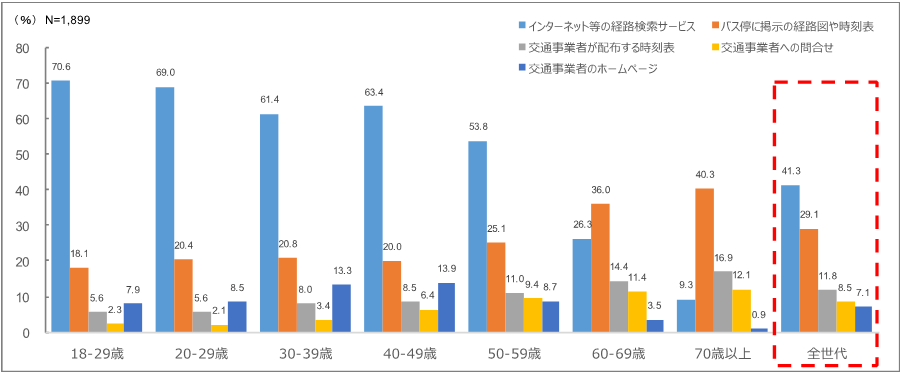
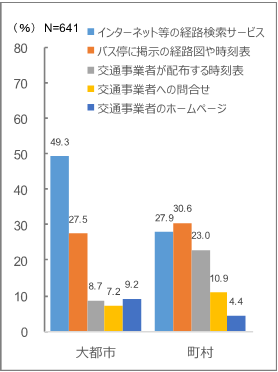

# はじめよう！「標準的なバス情報フォーマット」

【記載中】全体的に、リアルタイム対応にあわせて要修正

# 「標準的なバス情報フォーマット」の概要

「GTFS-JP」は、①一般的な表計算ソフトでも取扱が容易な形式でバス事業者が二次利用可能であること、②データ項目やデータ形式が経路検索に利用可能なことが確認されていること、③データ項目等を定義するレファレンスが早期に整備可能であること等に留意の上、GTFSを基本とし、GTFSですでに定義済みの項目はそのまま活かし、国内の経路検索で必要となる項目を追加する形で定義しました。

「GTFS-JP」は、GTFSとも互換性があるため、Googleマップをはじめとした海外の事業者へも情報提供を行うことが可能になっています。

なお、本版のGTFS-JPは、2017年1月時点のGoogle社の日本語版GTFSリファレンス(https://developers.google.com/transit/gtfs/reference/?hl=ja)に基づいています。

## GTFS(General Transit Feed Specification)とは

公共交通機関の時刻表とその地理的情報に使用される共通形式を定義したもので、当初はGoogle社向けのフォーマットとして作成されていました。現在はオープン化され、誰もが使用できるものとなっています。

零細事業者の利用も視野に、表計算ソフトでの閲覧が容易なCSV形式を採用し、仕様がオープン化されていることから、北米・欧州を中心に海外で幅広く利用されています。また、GTFSで作成したデータを一定のルールに基づき提供することで、Googleマップで当該交通機関の情報が案内される仕組みもあります。

## フォーマット制定の目的

経路検索サービスによるバス情報の案内については、大手の事業者の多くが対応済みとなっている一方で、規模の小さい事業者や自治体等が運営するコミュニティバス等は対応が進んでいない状況にあります。「標準的なバス情報フォーマット」は、経路検索に資する情報を経路検索事業者に提供できていないバス事業者の情報提供を促進するとともに、バス事業者と経路検索事業者等の情報利用者との間で簡易に情報の受渡しを可能とすることを目的として定めたのものです。

# データ整備のメリット

「標準的なバス情報フォーマット」に沿ってデータを整備することには、バス事業者や自治体には次のようなメリットがあります。

##  メリット1. 経路検索サービスに掲載される

### バスを調べる手段のNo.1は経路検索サービス

平成28年12月に内閣府が行った世論調査において、路線バスの利用手段・経路などを調べる場合、どのようにして情報を得ることが多いか聞いたところ、「インターネット等の経路検索サービス」を挙げた者の割合が41.3％と最も高く、居住地別では大都市、年代別では50歳代までの回答者でその割合が高くなっています。

### 検索できないバスは走っていないも同然!?

地図上に路線が記載され、定期刊行物として時刻表が発行される鉄道と比較し、バスは路線網が複雑で路線の改廃やダイヤ改正も多く、路線の地図への記載や網羅的に情報提供する刊行物等も存在しないため、その存在自体が認識されていないケースも多くなっています。特に、交通手段を調べる際に経路検索を利用することが多い都市部の居住者等にとっては、経路検索で情報が表示されない場合、当該地域に公共交通が存在していないことと同義と認識されつつあります。

### 他社線・鉄道・徒歩ともシームレスに案内

バス事業者が経路検索事業者に情報を提供することで、経路検索において鉄道・バス等の公共交通機関のシームレスな案内が可能となり、利用者はバスの存在を自然に認識することになります。これにより、これまで取りこぼしていた旅客の需要を取り込むことが可能となり、公共交通の活性化に寄与するものと考えられます。

### 地方部・中小・コミュニティバスも掲載される

これまで経路検索サービスに載りづらかった地方部、中小事業者、コミュニティバスについても、本フォーマットにてデータを整備することで、より多くの経路検索サービスに掲載されるようになります。

### 掲載費のかからないPR手段

現在、国内の主要な経路検索事業者においては、公共交通機関の情報を案内することに関して、交通事業者に対して特段の費用負担等は求めておりません。交通事業者は情報を提供するだけで自社路線を無料でPRすることができ、経路検索は利便性向上のみならず新規顧客開拓にも有効なツールになるものと考えられます。

## メリット2. リアルタイム情報も掲載される

## メリット3. データの精度・鮮度を向上しやすい

## メリット4. 多様な情報提供ができる

## メリット5. 業務の効率化ができる

