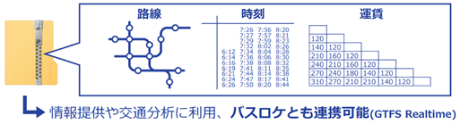

# はじめよう！「標準的なバス情報フォーマット」（案）

「標準的なバス情報フォーマット」とは、バス事業者と、経路検索等の情報利用者との情報の受渡しのための共通フォーマットです。

## フォーマットの構成

本フォーマットは、静的データ「GTFS-JP」と動的データ「GTFSリアルタイム」の2種類のフォーマットを包含しています。

| 区分       | フォーマット名                   | 対象とする情報                    | ファイル形式              |
| ---------- | -------------------------------- | --------------------------------- | --------------------------------- |
| 静的データ | GTFS-JP                          | 停留所、路線、便、時刻表、運賃 等 | csvをzipで圧縮 |
| 動的データ | GTFSリアルタイム 略称：GTFS-RT | 遅延、到着予測、車両位置、運行情報 等 | Protocol Buffers |

静的、動的どちらのフォーマットも国際的に広く利用されている「GTFS」(General
Transit Feed Specification)を基本としているため、整備した情報が迅速に世界中の経路検索サービスに反映されるという特長があります。

